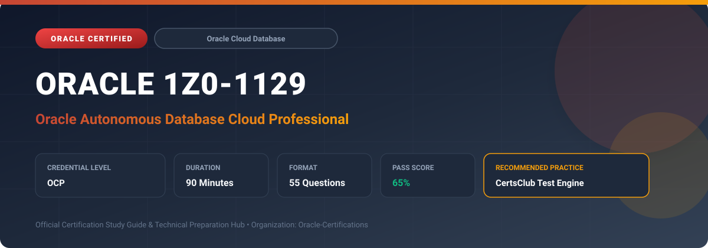

  

# Oracle 1Z0-1129: Oracle Autonomous Database Cloud Professional

---

## 1. Exam Overview & Candidate Profile

The **Oracle 1Z0-1129: Oracle Autonomous Database Cloud Professional** certification validates database administrators and architects who provision, manage, scale, and optimize Oracle Autonomous Database workloads.

Candidates demonstrate mastery of Autonomous Transaction Processing (ATP), Autonomous Data Warehouse (ADW), Autonomous JSON Database (AJD), auto-scaling, Autonomous Data Guard, cloning, APEX, Database Actions, and security encryption.

### Target Audience & Prerequisites
- **Target Roles**: Implementation Specialists, Cloud Architects, Technical Leads, Enterprise Consultants, and Systems Engineers.
- **Recommended Experience**: 1–2 years of practical, hands-on experience designing, implementing, and maintaining corresponding Oracle solutions.
- **Credential Earned**: OCP Certification.

---

## 2. Key Exam Specifications

| Specification | Details |
| :--- | :--- |
| **Exam Code** | **Oracle 1Z0-1129** |
| **Official Title** | Oracle Autonomous Database Cloud Professional |
| **Certification Track** | Oracle Cloud Database |
| **Exam Duration** | 90 Minutes |
| **Number of Questions** | 55 Questions |
| **Passing Score** | 65% |
| **Question Format** | Multiple Choice (Single/Multiple Answer), Scenario-Based Questions |
| **Delivery Provider** | Oracle University / Pearson VUE (Online Proctored or Test Center) |
| **Recommended Practice Engine** | [CertsClub Oracle Practice Tests](https://www.certsclub.com/oracle/1z0-1129-dumps.html) |

---

## 3. Official Blueprint & Exam Domain Breakdown

The examination assesses candidate competencies across core functional domains weighted as follows:

| Domain Area | Weighting |
| :--- | :--- |
| **Autonomous Database Architecture & Workload Types (ATP, ADW, AJD)** | `25%` |
| **Provisioning, Scaling & Lifecycle Management** | `25%` |
| **Autonomous Data Guard, High Availability & Disaster Recovery** | `20%` |
| **Data Loading, Migration Tools & Database Actions** | `15%` |
| **Security, Access Control, Encryption & Monitoring** | `15%` |

---

## 4. Deep Dive into Complex & Challenging Technical Topics

To secure a passing score on the 1Z0-1129 exam, candidates must master the following advanced concepts:

- Differentiating ATP (row-format, low-latency OLTP) vs ADW (columnar, vectorized analytics queries) vs AJD.
- Configuring compute auto-scaling (up to 3x base CPU allocation) and storage auto-expansion.
- Setting up local and cross-region Autonomous Data Guard with zero data loss failover.
- Ingesting data from Object Storage using DBMS_CLOUD package and Data Pump logical migrations.
- Securing Autonomous Database with mutual TLS (mTLS) wallets, TLS without wallet, and customer-managed keys (OCI Vault).

---

## 5. Scenario-Based Demo & Practice Questions

### Question 1
Which PL/SQL package in Oracle Autonomous Database provides built-in procedures for creating external tables, loading data files, and reading directly from OCI Object Storage and AWS S3 buckets?

A) DBMS_CLOUD
B) UTL_FILE
C) DBMS_DATAPUMP
D) DBMS_SCHEDULER

- **Correct Answer**: `A) DBMS_CLOUD`  
- **Technical Explanation**: The DBMS_CLOUD package is specifically designed for Autonomous Database to manage object storage credentials, load data, and query external data lake files seamlessly.

---

### Question 2
What happens when auto-scaling is enabled on an Oracle Autonomous Database instance provisioned with 4 base ECPUs during a sudden spike in user queries?

A) The instance automatically scales up to 12 ECPUs without restarting or interrupting active connections
B) The instance reboots into an Exadata dedicated rack
C) Connections are queued until queries complete
D) A new duplicate database instance is created

- **Correct Answer**: `A) The instance automatically scales up to 12 ECPUs without restarting or interrupting active connections`  
- **Technical Explanation**: Autonomous Database compute auto-scaling dynamically provides up to 3 times the base provisioned CPU capacity (4 x 3 = 12 ECPUs) instantly and transparently with zero downtime.

---

## 6. Recommended Preparation Strategy & Practice Testing Engine

Achieving certification in **Oracle 1Z0-1129** requires balanced theoretical study and scenario-based simulation practice:

1. **Review Oracle Documentation**: Master architecture guides, implementation workbooks, and administration manuals on the Oracle Help Center.
2. **Hands-on Lab Practice**: Execute real-world configuration, policy setup, and troubleshooting tasks in your cloud tenancy or test instance.
3. **Simulated Exam Drills**: Practice answering timed, scenario-based multiple-choice questions to familiarize yourself with the question formats, traps, and timing constraints.

### Practice With CertsClub
For realistic practice questions, updated dumps, and mock testing environments:
- **Resource**: [CertsClub Oracle Practice Test Engine](https://www.certsclub.com/oracle/1z0-1129-dumps.html)
- **Special Discount**: Use coupon code **`club20`** during checkout for an instant **20% discount** on all practice exam bundles and testing engines.

---

## 7. Official Documentation & References

- [Oracle University Certification Registry](https://education.oracle.com/)
- [Oracle Help Center Documentation Portal](https://docs.oracle.com/)
- [Oracle Cloud Infrastructure & Applications Guides](https://docs.oracle.com/en/cloud/)
- [CertsClub Oracle Certification Exam Practice](https://www.certsclub.com/oracle/1z0-1129-dumps.html)

---

## 8. SEO & Discovery Keywords

`oracle 1z0-1129, oracle 1z0-1129 exam, oracle 1z0-1129 dumps, 1Z0-1129 practice questions, 1Z0-1129 study guide, oracle autonomous database cloud professional, certsclub 1z0-1129`